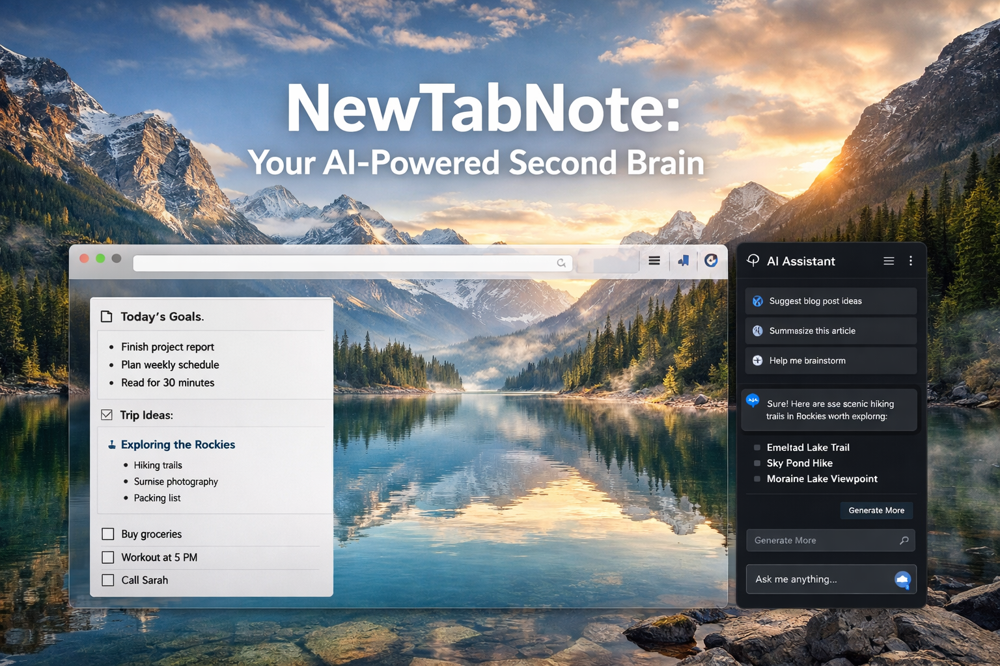
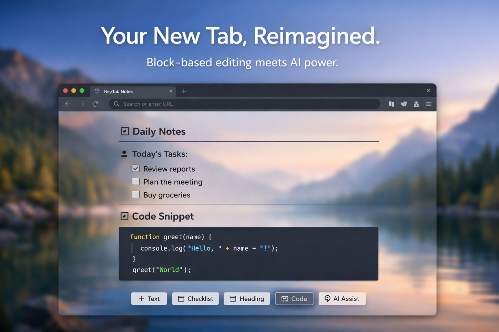
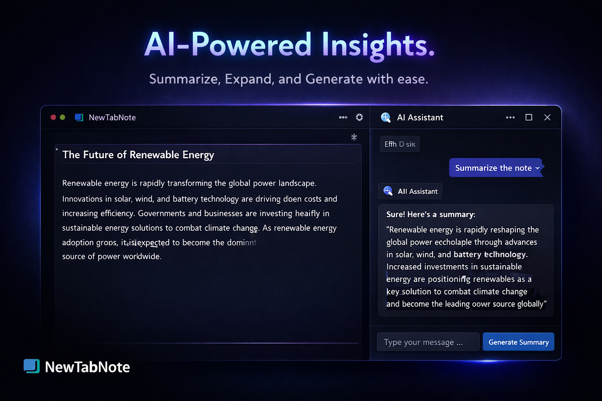
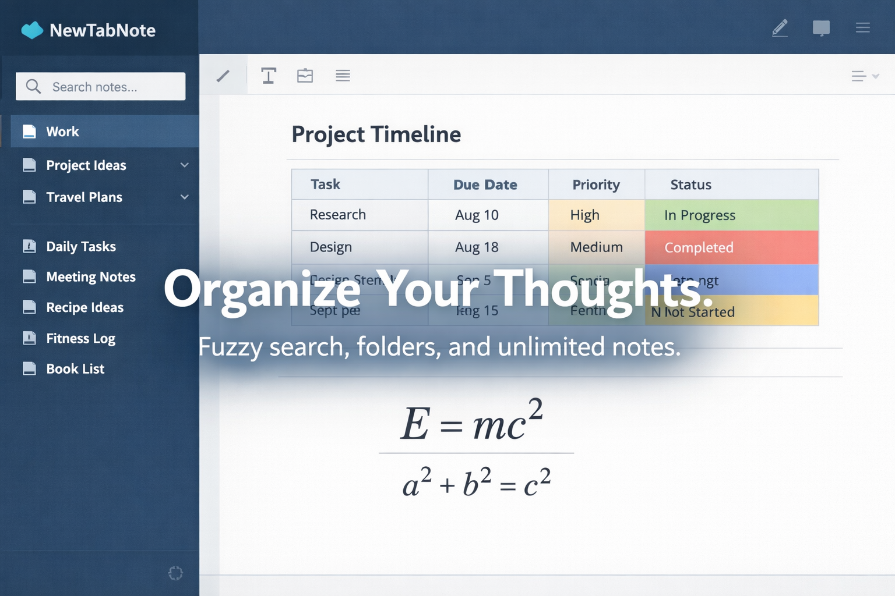

# NewTabNote: Transform Your New Tab into an AI-Powered Second Brain



**NewTabNote** replaces your blank new tab page with a professional, block-based editor inspired by Notion and Obsidian. Whether you're capturing quick ideas, managing complex projects, or using AI to summarize your thoughts, NewTabNote is designed for speed, privacy, and productivity.

## 🚀 Key Features

### 📝 Advanced Block-Based Editor

- **18+ Block Types**: Structured content with headings, tables, code blocks, math equations (LaTeX), and more.
- **Slash Commands**: Type `/` to instantly access any block type.
- **Markdown Support**: Use familiar shortcuts like `#`, `-`, `>`, and `` ``` `` for lightning-fast writing.
- **Drag & Drop**: Effortlessly reorder your thoughts with a simple handle.

### 🤖 Your Personal AI Assistant

- **Smart Summarization**: Get the gist of long notes in seconds.
- **Content Expansion**: Let AI help you flesh out ideas and add detail.
- **Auto-Titling**: Never see "Untitled" again—AI generates relevant titles based on your content.
- **Multi-Provider Support**: Connect to OpenAI (GPT-4o), Anthropic (Claude 3.5), Google Gemini, or even local models via Ollama.

### 📂 Professional Organization

- **Unlimited Notes & Folders**: Organize your life without limits.
- **Fuzzy Search**: Find any note instantly by searching titles or content.
- **Tabbed Interface**: Work on multiple notes simultaneously with a familiar tabbed view.
- **Daily Notes**: One-click access to your daily journal or scratchpad.

### 🔒 Privacy & Performance First
- **100% Local Storage**: Your data stays in your browser (IndexedDB). No servers, no tracking.
- **Offline Ready**: Works perfectly without an internet connection (except AI features).
- **Export/Import**: Full control over your data with JSON and Markdown export options.

---

## 🎨 Customization
- **Themes**: Light, Dark, and System modes.
- **Typography**: Choose between System, Serif, or Monospace fonts.
- **Layout**: Adjustable editor width (Narrow to Full Width) and resizable sidebar.

---

## 💡 Why NewTabNote?
Most "New Tab" extensions are either too simple or cluttered with ads. NewTabNote is built for power users who want a clean, distraction-free environment that feels like a premium desktop app, right inside their browser.

---

## 📥 Installation

### From Chrome Web Store (Recommended)
**[Install NewTabNote on the Chrome Web Store](https://chromewebstore.google.com/detail/new-tab-note/emildbpnneonfcanpfnafkphiflbddig)**

### Manual Installation (Developer Mode)
1. Download the latest `new-tab-note-vX.X.X.zip` from [Releases](https://github.com/keyurgolani/new-tab-note/releases)
2. Extract the zip file to a permanent location
3. Open Chrome and navigate to `chrome://extensions/`
4. Enable **"Developer mode"** in the top right corner
5. Click **"Load unpacked"** and select the extracted folder
6. Open a new tab to start using NewTabNote

### From Source (Development)
1. Clone this repository
2. Install dependencies: `npm install`
3. Build the extension: `npm run build`
4. Open Chrome and navigate to `chrome://extensions/`
5. Enable **"Developer mode"** in the top right corner
6. Click **"Load unpacked"** and select the `dist` folder
7. Open a new tab to start using NewTabNote

---

## 🛠 Development

### Scripts
```bash
# Install dependencies
npm install

# Build for production (minified)
npm run build

# Build for development (no minification)
npm run build:dev

# Create release package (.zip)
npm run package

# Full release build (clean + build + package)
npm run release
```

---

## 🔒 Privacy
- All notes are stored locally in your browser's IndexedDB.
- No data is sent to any server except when using AI features.
- AI requests go directly to your configured provider with your API key.
- API keys are stored locally and never transmitted elsewhere.

For complete details, see our [Privacy Policy](PRIVACY_POLICY.md).

---

## 📜 License
MIT
