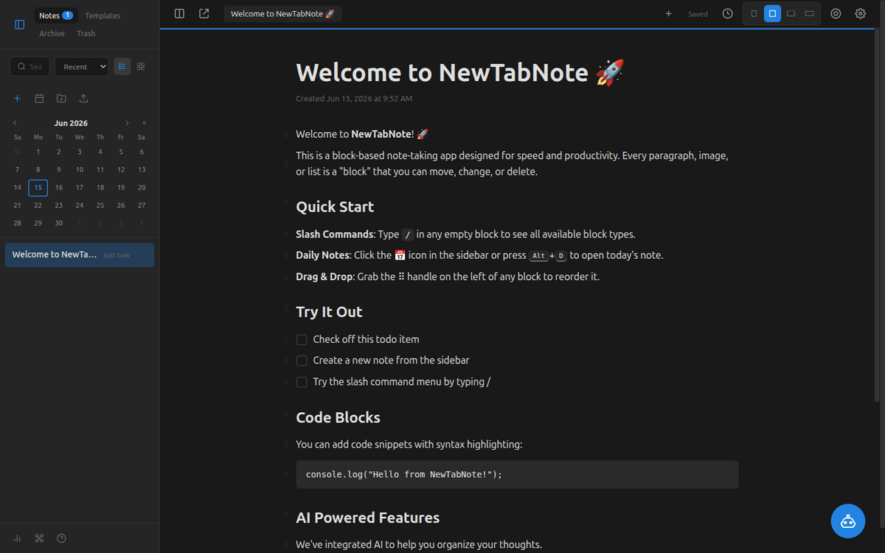
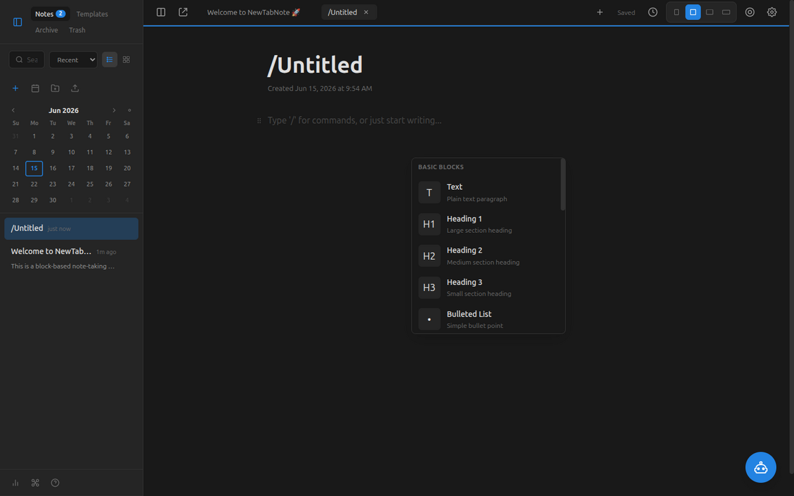
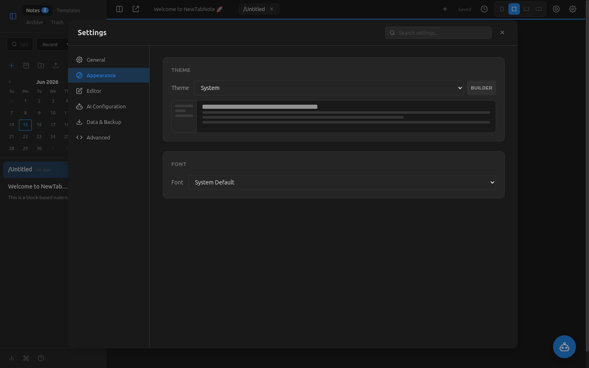
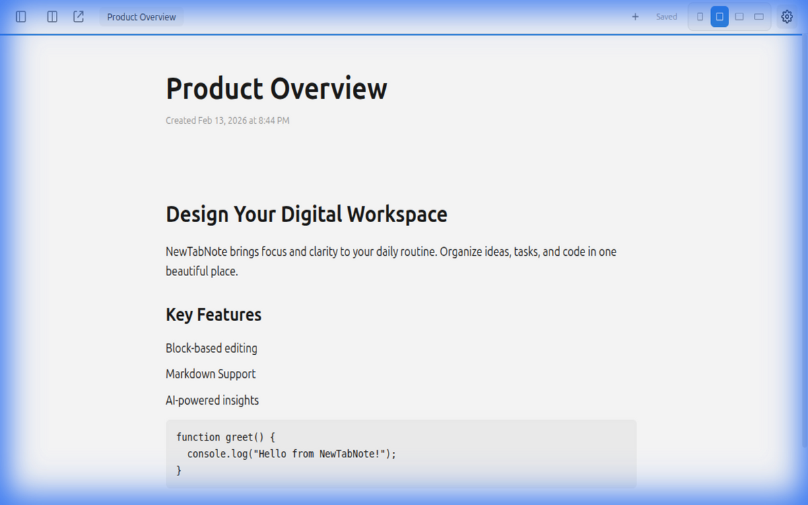
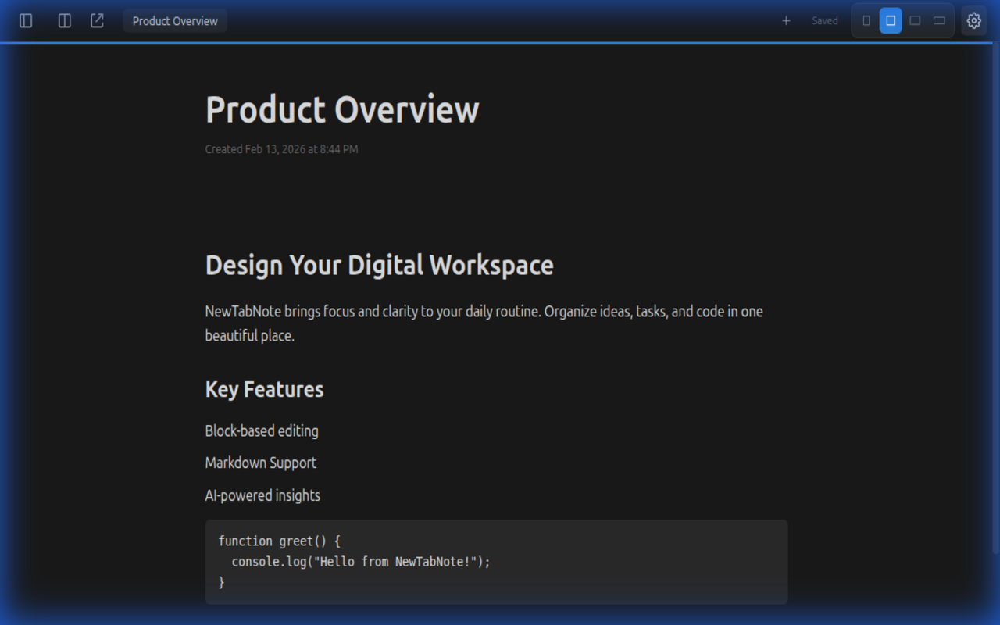

# 📝 NewTabNote — Visual Showcase

Real screenshots of NewTabNote in action — a block-based, Notion-style note editor that replaces your browser's new-tab page. 100% local, privacy-first, with an AI assistant and a fast keyboard-driven editor.

> _Captured from a development build of the extension's new-tab page. The bundled welcome note is shown as sample content._

---

## 🏠 The New Tab, Reimagined

Open a new tab and land in a full block-based workspace: a notes sidebar with search, a month calendar for daily notes, and a rich editor with headings, to-do items, code blocks, and more.



---

## ⚡ Slash Commands

Type `/` in any empty block to bring up the block menu — Text, Headings, lists, code, and 18+ block types in total. Markdown shortcuts (`#`, `-`, `>`, ```` ``` ````) work too.



---

## ⚙️ Settings & Theming

Tune the experience across General, Appearance, Editor, AI Configuration, Data & Backup, and Advanced. Appearance offers Light/Dark/System themes (plus a theme builder), font choices, and a live preview.



---

## 🌗 Light & Dark Themes

The editor in both light and dark modes — dark mode is built for nighttime use.

<p align="center">
  
  
</p>

---

## ✨ At a Glance

| Capability | Detail |
|------------|--------|
| **Editor** | Block-based, 18+ block types, slash commands, Markdown shortcuts, drag-and-drop |
| **AI** | Summarize, expand, auto-title; OpenAI / Anthropic / Gemini / local Ollama |
| **Organization** | Unlimited notes & folders, fuzzy search, tabs, daily notes, backlinks |
| **Privacy** | 100% local storage (IndexedDB), offline-ready, no tracking |
| **Customization** | Themes (Light/Dark/System), fonts, adjustable editor width |
| **Data** | JSON / Markdown export & import |
| **Stack** | Vanilla JS Chrome extension (Manifest V3), zero runtime framework deps |

---

_See the [README](README.md) for installation (Chrome Web Store or developer mode) and full feature details._
